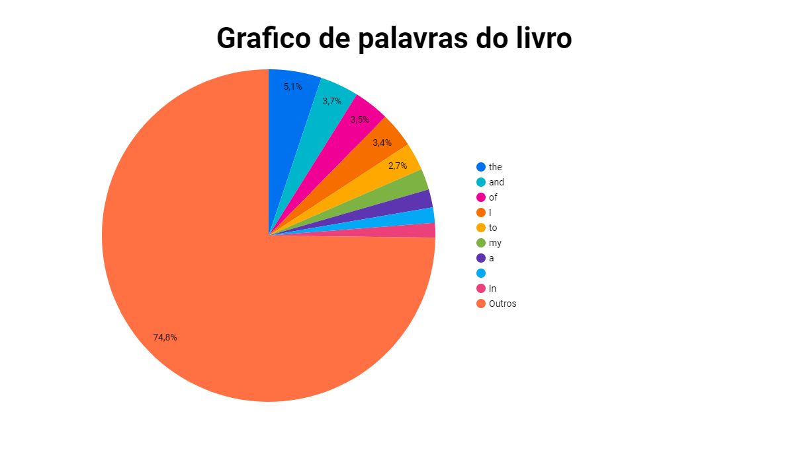

# Digital Innovation One

Código criado para utilização junto a plataforma da Digital Innovation One

<p align="center"></p>

## Desafio GCP Dataproc

O desafio faz parte do curso na plataforma da Digital Innovation One:

__*Criando um ecossistema Hadoop totalmente gerenciado com Google Cloud Platform*__

O desafio consiste em efetuar um processamento de dados utilizando o produto Dataproc do GCP. Esse processamento irá efetuar a contagem das palavras de um livro e informar quantas vezes cada palavra aparece no mesmo.

---

### Etapas do Desafio

1. Criar um bucket no Cloud Storage
2. Atualizar o arquivo ```contador.py``` com o nome do Bucket criado nas linhas que contém ```{SEU_BUCKET}```.
3. Fazer o upload dos arquivos ```contador.py``` e ```livro.txt``` para o bucket criado (instruções abaixo)
    - https://cloud.google.com/storage/docs/uploading-objects

4. Utilizar o código em um cluster Dataproc, executando um Job do tipo PySpark chamando ```gs://{SEU_BUCKET}/contador.py```
5. O Job irá gerar uma pasta no bucket chamada ```resultado```. Dentro dessa pasta o arquivo ```resultado.csv``` irá conter a lista de palavras e quantas vezes ela é repetida em todo o livro.
6. Se utilizando do arquivo ```resultado.csv``` vamos mostrar esses dados em um formato de graficos utilizando o Looker Studio (anteriormente Google Data Studio)
7. Acesse o Looker Studio (Google Data Studio).
8. Crie um novo relatório ou abra um relatório existente.
9. Clique em "Adicionar dados" e selecione o conector do Google Cloud Storage.
10. Autentique-se e selecione o arquivo ```resultado.csv``` dentro do bucket.
11. Configure o esquema de dados para garantir que as colunas "Word" e "Count" sejam reconhecidas corretamente.
12. Adicione visualizações ao relatório para analisar a contagem de palavras, como gráficos de barras, tabelas e outros componentes visuais.

### Entrega do Resultado

No lookerstudio gerar um link de compartilhamento publico para que as pessoas possam ver como esse link: https://lookerstudio.google.com/s/kgCc1pM1P1k



---

### Considerações Finais

NOTA: Se o Job mostrar um WARN de Interrupt, basta ignorar. Existe um bug no Hadoop que é conhecido. Isso não impacta no processamento.

Qualquer outra dúvida, informação ou sugestão, fique a vontade para entrar em contato.

marcelo@smarques.com
